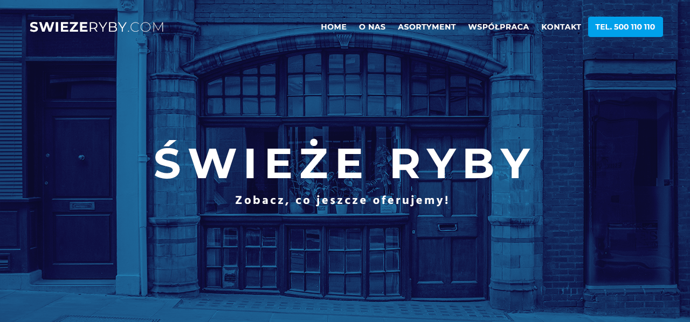

# Project Title

Freshy

## Live Demo

[https://pndiogo.github.io/freshy/](https://pndiogo.github.io/freshy/)

## Info

Markup practice converting PSD mockup to HTML/CSS

## Features

- Responsive design

## Built With

- Bootstrap
- HTML5
- CSS3
- CSS Grid
- CSS Flexbox
- Git

## Authors

- Paulo Diogo - [github.com/pndiogo](https://github.com/pndiogo)
- PSD template - [DesignLazy](https://www.designlazy.com/freshy-website-template/) by Michal Trykoszko

## License

This project is licensed under the MIT License - see the [LICENSE.md](LICENSE.md) file for details
